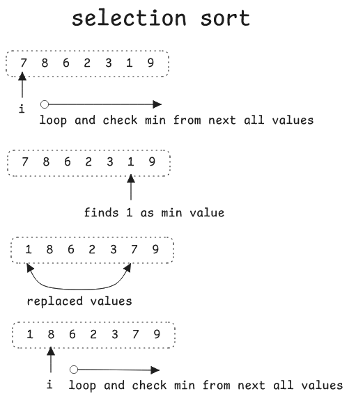

**Time Complexities of Sorting Algorithms** 🧠💥
I’ll break it down by **Best, Average, and Worst Cases**, with a super intuitive vibe and some pro tips along the way.

---

## 🔢 Sorting Algorithms Cheat Sheet (Time Complexity)

| Algorithm          | Best Case 🟢 | Average Case 🟡 | Worst Case 🔴 | Space      | Stable? | Notes 📝                           |
| ------------------ | ------------ | --------------- | ------------- | ---------- | ------- | ---------------------------------- |
| **Bubble Sort**    | O(n)         | O(n²)           | O(n²)         | O(1)       | ✅       | Good for learning; not used IRL    |
| **Insertion Sort** | O(n)         | O(n²)           | O(n²)         | O(1)       | ✅       | Great for small or nearly-sorted   |
| **Selection Sort** | O(n²)        | O(n²)           | O(n²)         | O(1)       | ❌       | Always does n² comparisons         |
| **Merge Sort**     | O(n log n)   | O(n log n)      | O(n log n)    | O(n)       | ✅       | Very consistent performance        |
| **Quick Sort**     | O(n log n)   | O(n log n)      | O(n²)         | O(log n)\* | ❌       | Fastest in practice (usually)      |
| **Heap Sort**      | O(n log n)   | O(n log n)      | O(n log n)    | O(1)       | ❌       | Not stable, good for limited RAM   |
| **Counting Sort**  | O(n + k)     | O(n + k)        | O(n + k)      | O(k)       | ✅       | Only works on small integer ranges |
| **Radix Sort**     | O(nk)        | O(nk)           | O(nk)         | O(n + k)   | ✅       | Used for integers, strings         |
| **Bucket Sort**    | O(n + k)     | O(n + k)        | O(n²)         | O(n + k)   | ✅       | Depends on input distribution      |

---
## Quick recap!

### 🔵 Selection Sort

* It works by repeatedly finding the minimum element from the unsorted part of the array and moving it to the beginning.
* Best: O(n²)
* Worst: O(n²)

> 💬 Kinda like checking your playlist one song at a time and reshuffling it manually.

---

### 🔵 Bubble Sort

* Compares and swaps adjacent elements — over and over 😴
* Best: Already sorted = O(n)
* Worst: Reversely sorted = O(n²)

> 💬 Kinda like checking your playlist one song at a time and reshuffling it manually.

---

### 🟢 Insertion Sort

* Builds the sorted array one item at a time
* Super fast for **small** or **almost sorted** arrays

> 💡 Used in Timsort and for cutoff optimization inside Merge Sort

---

### 🔴 Quick Sort

* Picks a **pivot** and partitions the array around it
* Average case: O(n log n), BUT worst case is O(n²) if bad pivots are chosen

> ⚠️ Random pivoting or Median-of-Three fixes the worst-case problem!

---

### ⚙️ Merge Sort

* Recursively splits the array in halves and merges sorted parts
* Very **consistent** time: O(n log n) in all cases
* Downside: Needs O(n) extra memory

> 🚀 Often used in stable sorting and when data can't fit into memory

---

### 💣 Heap Sort

* Builds a heap and extracts the min/max repeatedly
* No recursion, just smart mathy moves

> 💾 Good when memory is tight but not cache-friendly

---

### 🔥 Radix & Counting Sort

* Non-comparative sorting for **integers or fixed-size strings**
* Counting Sort: O(n + k), where `k = max element`
* Radix Sort: O(nk), where `k = digit count`

> 🤓 These crush performance when input domain is limited

---

## 💥 TL;DR: What should I use?

| Situation                         | Recommended Algorithm         |
| --------------------------------- | ----------------------------- |
| Small arrays                      | Insertion Sort                |
| General-purpose sorting           | Quick Sort or Merge Sort      |
| Memory-constrained environments   | Heap Sort                     |
| Need stability                    | Merge Sort, Bubble, Insertion |
| Sorting integers in limited range | Counting / Radix Sort         |
| Partially sorted data             | Insertion or Timsort          |

